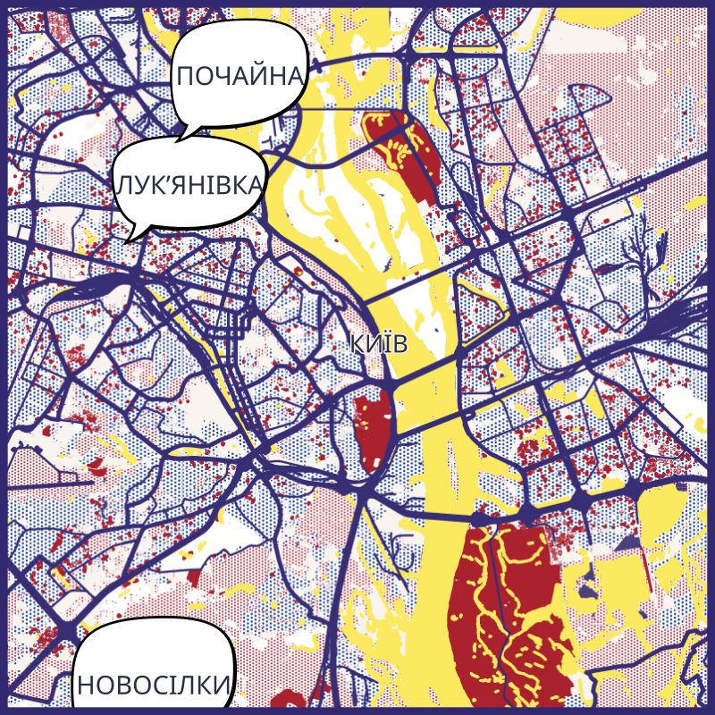
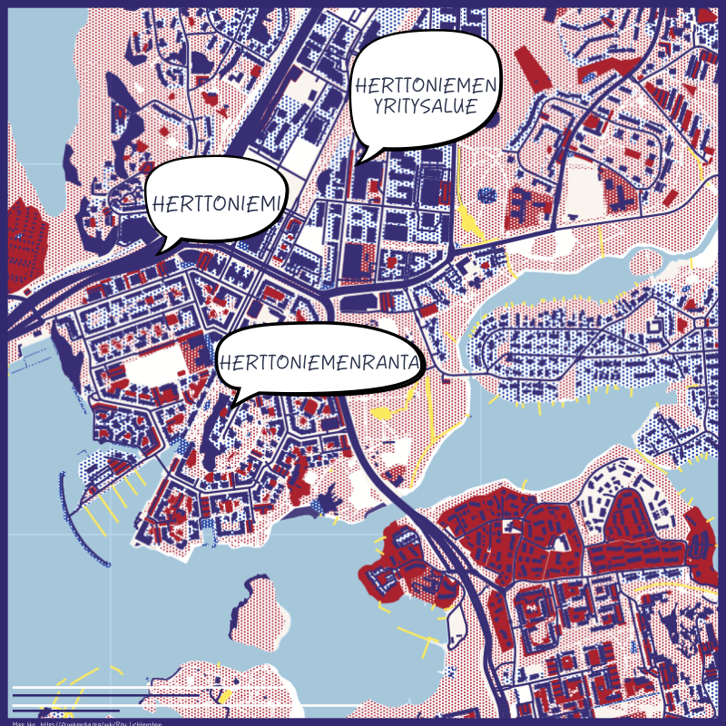

# QGIS-Resources

This repository contains styles that can be shared with the QGIS Resources Sharing.

## OSM vector tiles

[roy.qml](collections/osm_vector_tiles/style/roy.qml) : a style for OSM vector tiles (https://vector.openstreetmap.org/shortbread_v1/{z}/{x}/{y}.mvt), like [Roy Lichtenstein](https://en.wikipedia.org/wiki/Roy_Lichtenstein).

